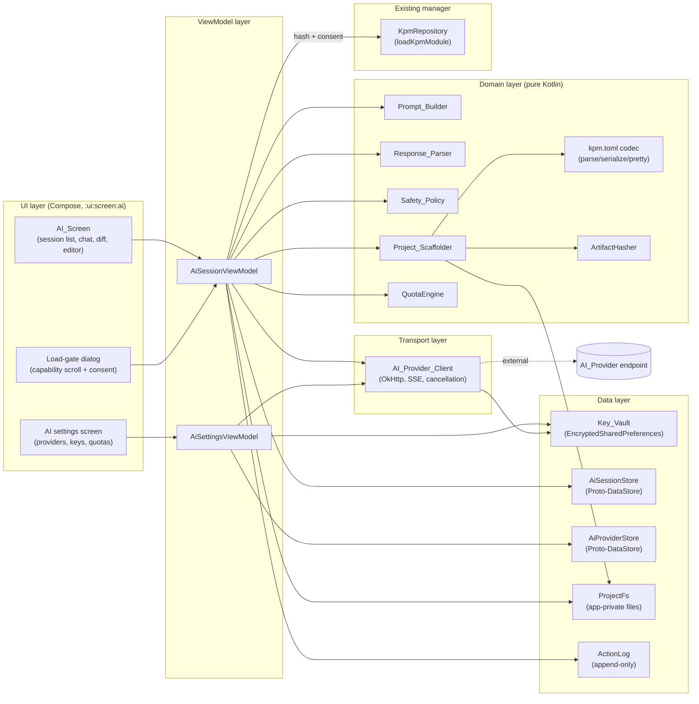
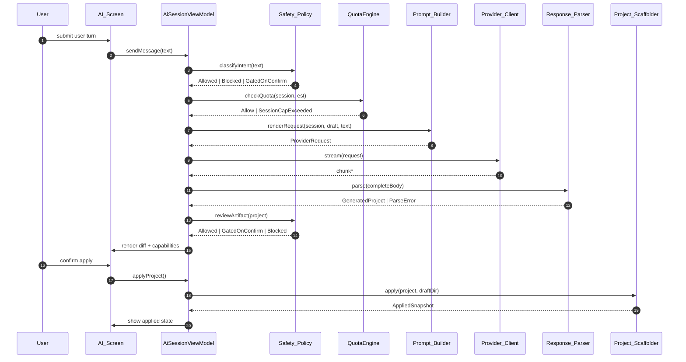

# Design Document

## Overview

This feature adds an **AI-assisted KPM plugin authoring** subsystem to the SukiSU-Ultra manager app. The user describes the desired kernel behaviour in natural language, a user-configured LLM produces a complete KPM project (C/H sources, `Makefile`/`Kbuild`, and a `kpm.toml` manifest), the manager lets the user review/diff/edit the output, and — only after explicit consent — hands the artifact off to the existing `loadKpmModule` path. No kernel-side changes, no in-app cross-compilation, no hard-coded vendor credentials.

Design priorities, in order:

1. **Safety and reviewability.** KPM runs in the kernel. The feature fails closed, gates every risky action on explicit consent, and never auto-loads generated artifacts.
2. **Privacy.** API keys live behind the Android Keystore; only the current project context leaves the device; local providers are first-class.
3. **Determinism and round-trip correctness.** The wire format between `Prompt_Builder` and `Response_Parser`, the `kpm.toml` manifest, the session serializer, and the ZIP exporter are all round-trip safe, so later refactors can be validated automatically.
4. **Fits the existing app.** UI is Jetpack Compose under `manager/app/src/main/java/com/sukisu/ultra/ui/screen/ai/`. Transport reuses OkHttp. Persistence reuses the Android-standard `EncryptedSharedPreferences` and Proto-DataStore. The load path reuses the existing `loadKpmModule` function — the AI feature does not reimplement the loader.

Inspirational reference: the `dugongzi/JsxposedX` "AI-assisted Xposed plugin authoring" flow. This design adapts that UX to a kernel-mode target, which forces stronger guardrails (capability declaration, load-gate, safety policy, user-visible diff before write).

### Out of Scope

- Any change to `kernel/kpm/*` or to `sukisu_kpm_load_module_path`.
- On-device cross-compilation of generated C into a loadable `.kpm`. The export step produces a source tree for an external kernel toolchain.
- Shipping any pre-configured AI provider, vendor, endpoint, or key.
- Automatic learning from user edits. The feature only uses user-modified files as context in later turns of the same session.
- Cross-session sharing of prompts, artifacts, or safety decisions outside the user-initiated export bundle.

## Architecture

### High-level component diagram



### Request lifecycle (happy path)



### Module and package layout

All new Kotlin code lives under:

- `manager/app/src/main/java/com/sukisu/ultra/ui/screen/ai/` — Compose screens, navigation entries.
- `manager/app/src/main/java/com/sukisu/ultra/ui/viewmodel/ai/` — ViewModels.
- `manager/app/src/main/java/com/sukisu/ultra/data/ai/` — Proto-DataStore schemas, repositories, Key_Vault.
- `manager/app/src/main/java/com/sukisu/ultra/domain/ai/` — pure domain: `Prompt_Builder`, `Response_Parser`, `Safety_Policy`, `Project_Scaffolder`, manifest codec, `QuotaEngine`, `ArtifactHasher`.
- `manager/app/src/main/java/com/sukisu/ultra/net/ai/` — `AI_Provider_Client` (OkHttp wrapper, SSE reader).

Domain classes are **pure Kotlin** (no Android framework imports, no I/O). This keeps them unit-testable and property-testable on the JVM without instrumentation.

## Components and Interfaces

The components below match the Glossary in `requirements.md` one-to-one. Method signatures are shown as Kotlin pseudocode at the interface level; concrete implementations live in the packages above.

### AI_Screen (Compose UI)

Entry points:

- `AiSessionListScreen` — lists `AI_Session`s, last-updated desc.
- `AiSessionScreen` — per-session chat, file tree, diff view, editor.
- `AiProviderSettingsScreen` — CRUD for `AI_Provider`, active-provider toggle, "Test connection".
- `AiSafetyDisclaimerDialog` — first-run modal per Req 9.
- `AiLoadGateDialog` — capability-scroll consent per Req 7.

Navigation is added through the manager's existing Navigation3 graph; no changes to existing screens.

### AI_Session (state + persistence)

```kotlin
data class AiSession(
    val id: SessionId,
    val title: String,
    val providerRef: ProviderId,
    val draftDir: RelativePath,        // relative to app-private AI root
    val turns: List<Turn>,             // ordered, monotonic turnIndex
    val createdAt: Instant,
    val updatedAt: Instant,
    val tokenUsage: TokenUsageTotals,
    val quotaCap: TokenCap?,
)

sealed interface Turn {
    val turnIndex: Int
    val createdAt: Instant
    data class User(override val turnIndex: Int, override val createdAt: Instant, val text: String) : Turn
    data class Assistant(
        override val turnIndex: Int, override val createdAt: Instant,
        val text: String,
        val usage: TokenUsage?,
        val requestMeta: RequestMeta,   // modelId, temperature, topP?, seed?, templateId, systemPromptHash
        val safety: SafetyDecision,
        val failure: TurnFailure?,      // null on success
    ) : Turn
}
```

Persisted via `AiSessionStore` (Proto-DataStore, one proto message per session). `serialize` / `deserialize` are deterministic and round-trip safe (Req 11.3).

### AI_Provider_Client (transport)

```kotlin
interface AiProviderClient {
    suspend fun stream(request: ProviderRequest): Flow<ProviderChunk>
    suspend fun testConnection(provider: AiProvider): TestConnectionResult
}
```

- Built on OkHttp (already in `manager/app/build.gradle.kts`).
- Wire format: OpenAI-compatible chat-completions JSON with `stream: true`. SSE decoded line-by-line.
- All work runs on `Dispatchers.IO`. Callers pass a `CoroutineScope` from a `ViewModel` — no `GlobalScope`.
- Cancellation: cancelling the caller's coroutine cancels the `Call`. The HTTP stack is built with a dedicated `OkHttpClient` whose `callTimeout` defaults come from the provider record.
- URL guard (Req 13.4): the only URL the client ever hits is `provider.baseUrl.resolve(chatCompletionsPath)`. No redirects to other hosts (`followRedirects = false` on the dedicated client).
- Header guard (Req 13.1): the allow-listed request headers are `Authorization`, `Content-Type`, `Accept`, and provider-declared extras from `AiProvider.extraHeaders`. Device identifiers and installed-package lists are never attached.

### Prompt_Builder (pure)

```kotlin
object PromptBuilder {
    fun renderRequest(
        templates: PromptTemplateSet,
        session: AiSession,
        draft: ProjectDraftView,      // current on-disk files, including user edits (Req 4.5)
        userTurn: String,
        referenceContext: KpmReferenceContext, // Req 3.1–3.2
    ): ProviderRequest

    fun renderExpectedOutput(project: GeneratedProject): String   // used for round-trip (Req 11.1)
    fun systemPromptHash(request: ProviderRequest): HashDigest    // Req 15.1
}
```

`PromptTemplateSet` is a versioned, read-only asset loaded from `assets/ai/prompts/` so the template id (`templateId`) is stable and persistable. `KpmReferenceContext` is built at app start from the embedded excerpts of `kernel/kpm/kpm.c`, `kernel/kpm/kpm.h`, and the C/C++ sections of `.cursor/rules/general.mdc`.

### Response_Parser (pure, defensive)

```kotlin
sealed interface ParseResult {
    data class Ok(val project: GeneratedProject) : ParseResult
    data class Err(val reason: ParseError, val location: SourceLocation) : ParseResult
}

object ResponseParser {
    fun parse(body: String): ParseResult
}
```

Treated as an **untrusted parser** over untrusted input. Never partially materialises files (Req 3.6). Does not execute any shell or code. The wire format is described in detail in [Wire Format](#wire-format-between-prompt_builder-and-response_parser).

### Project_Scaffolder

```kotlin
interface ProjectScaffolder {
    suspend fun apply(project: GeneratedProject, draftDir: AbsolutePath): ApplyResult
    suspend fun diff(current: ProjectDraftView, next: GeneratedProject): ProjectDiff
}
```

Apply is **atomic**: writes to a sibling `draftDir.tmp`, fsyncs, then `renameat2(..., RENAME_EXCHANGE)` when available, with a best-effort copy-and-swap fallback. On any failure the draft directory is restored (Req 3.7, Req 12.3). Apply is **idempotent**: re-applying the same `GeneratedProject` over a directory that already equals `apply(g, d)` produces the same `AppliedSnapshot` (Req 12.1).

Path validation (Req 3.8) is performed before any filesystem access:

- Normalise the declared `path` as a POSIX relative path.
- Reject if it contains `..` segments, a leading `/`, a backslash, a null byte, or if `(draftDir / path).normalize().startsWith(draftDir)` is false.
- Reject if the normalised path collides case-insensitively with another entry (defensive against cross-FS surprises).

### Safety_Policy

```kotlin
interface SafetyPolicy {
    fun classifyIntent(text: String): IntentDecision
    fun reviewArtifact(project: GeneratedProject): ArtifactDecision
}

sealed interface IntentDecision {
    object Allowed : IntentDecision
    data class Blocked(val categoryKey: String, val ruleId: RuleId) : IntentDecision
    data class GatedOnConfirm(val categoryKey: String, val ruleId: RuleId, val rationale: String) : IntentDecision
}
```

Rule types:

- **Intent rules** — regex/lexical heuristics over normalised user text for the disallowed categories enumerated in Req 8.1 (competitive-game cheating, credential/token theft, attestation bypass for fraud, mass surveillance, ransomware). Each rule has a stable `ruleId` and a localisation key `ai_safety_blocked_<category>`.
- **Artifact rules** — AST/lexical scans over generated C for the red flags enumerated in Req 8.2 (e.g. writes to unvalidated user-supplied kernel addresses, global SELinux disable without a matching `kpm.toml` toggle). Each rule produces `GatedOnConfirm` or `Blocked` with `ruleId`.
- **Fail closed** (Req 8.5): the engine runs inside a `runCatching` boundary in the ViewModel; any thrown exception is mapped to `Blocked("ai_safety_engine_error", ruleId = "engine.uncaught")`.

Every decision is appended to `ActionLog` with `{ruleId, categoryKey, truncatedRequestDigest}` (Req 8.3). False-positive retry (Req 8.4) is modelled as a second evaluation pass with the user's justification concatenated; re-evaluation is deterministic given the same inputs and rule set version.

### Key_Vault

```kotlin
interface KeyVault {
    fun put(providerId: ProviderId, apiKey: String)
    fun get(providerId: ProviderId): String?
    fun remove(providerId: ProviderId)
}
```

Backed by `EncryptedSharedPreferences` with `AES256_SIV` key alias and `AES256_GCM` value alias, master key in Android Keystore (`MasterKey.KeyScheme.AES256_GCM`). The file lives under the app's `no_backup` directory so adb backups never contain the ciphertext either. Redaction hooks in the logging interceptor and the bug-report exporter mask any string whose provider-id prefix matches a stored key.

### QuotaEngine (pure)

```kotlin
object QuotaEngine {
    fun check(cap: TokenCap?, cumulative: TokenTotals, estimated: Int): QuotaDecision
}

sealed interface QuotaDecision {
    object Allow : QuotaDecision
    data class Block(val errorId: String) : QuotaDecision  // "ai_quota_session_exceeded"
}
```

Pure function of `(cap, cumulative, estimated)`. No time, no randomness. Given identical inputs, it returns identical decisions (Req 10.4).

### ArtifactHasher (pure)

```kotlin
object ArtifactHasher {
    fun hash(project: GeneratedProject): HashDigest
}
```

`hash` sorts file entries by `path`, then feeds `SHA-256("kpmv1\n" + foreach(entry) { len(path) ":" path len(content) ":" content })`. This makes the hash **order-independent** (Req 12.2) and stable across equivalent re-serialisations.

## Data Models

### AI_Provider

```kotlin
enum class ProviderKind { Cloud, Local }

data class AiProvider(
    val id: ProviderId,
    val name: String,
    val baseUrl: HttpUrl,
    val modelId: String,
    val providerKind: ProviderKind,
    val extraHeaders: Map<String, String> = emptyMap(),
    val defaultTemperature: Double? = null,
    val defaultTopP: Double? = null,
    val defaultSeed: Long? = null,
    val callTimeoutMillis: Long = 60_000,
    // apiKey is NEVER stored here; it lives in Key_Vault keyed by `id`.
)
```

Validation rules (Req 1.8, 1.9, 14.1):

- `baseUrl` must parse as an absolute `http`/`https` URL.
- If scheme is `http`, host must be loopback (`127.0.0.0/8`, `::1`) or RFC1918 (`10/8`, `172.16/12`, `192.168/16`) **and** the provider's `providerKind` must be `Local`. Otherwise: `ai_provider_insecure_transport`.

### AI_Session and Turn

Defined above. Persisted via Proto-DataStore (`ai_sessions.pb`), one `AiSession` message per file, keyed by `id`. We use Proto-DataStore (not Room) because our access pattern is "load whole session / overwrite whole session" and we get a deterministic, round-trippable binary format for free.

### GeneratedProject and ProjectManifest

```kotlin
data class GeneratedProject(
    val manifest: ProjectManifest,
    val files: List<FileEntry>,
)

data class FileEntry(
    val path: RelativePath,         // POSIX relative, validated by Scaffolder
    val content: String,            // UTF-8 text
    val language: LanguageHint,     // C, CHeader, Makefile, Toml, Markdown, Other
)

data class ProjectManifest(
    val name: String,
    val version: String,            // SemVer
    val abiTarget: String,          // e.g. "sukisu-kpm/v1"
    val capabilities: Set<Capability>,
    val spdxLicense: String = "GPL-2.0-or-later",
    val generator: GeneratorMetadata,
)

data class GeneratorMetadata(
    val sessionId: SessionId,
    val modelId: String,
    val generatedAt: Instant,
    val templateId: String,
    val systemPromptHash: HashDigest,
)

enum class Capability {
    ReadsSyscalls,
    PatchesMemory,
    HooksSyscallTable,
    ModifiesSelinux,
    WritesFiles,
    SpawnsKthreads,
    // extend as rules land
}
```

### kpm.toml schema

Flat, unambiguous, deterministic. The pretty-printer emits keys in the order below, with a trailing newline and `LF` line endings; blank lines between sections only.

```toml
# Generated by SukiSU AI_Assistant. DO NOT EDIT generator.* by hand.

[package]
name = "example_kpm"
version = "0.1.0"
abi_target = "sukisu-kpm/v1"
spdx_license = "GPL-2.0-or-later"

[capabilities]
# Declared capabilities are sorted and de-duplicated.
values = ["HooksSyscallTable", "ReadsSyscalls"]

[generator]
session_id = "01J..."
model_id = "gpt-4o-mini"
generated_at = "2025-01-01T00:00:00Z"
template_id = "kpm-v1"
system_prompt_hash = "sha256:..."
```

The codec's `parse ∘ serialize` is the identity on all in-domain values (Req 11.2). `pretty` is a distinguished total function: for two manifests that compare equal as values, `pretty(a) == pretty(b)` byte-for-byte (Req 11.4).

### Wire format between Prompt_Builder and Response_Parser

The assistant is instructed to emit one fenced block per file plus a terminal manifest block. This keeps the format trivially recoverable from streaming output and human-readable in the chat UI.

```
<<<KPM-PROJECT v1>>>
--- FILE path="src/my_hook.c" lang="C" ---
#include ...
--- END FILE ---
--- FILE path="Kbuild" lang="Makefile" ---
obj-m += my_hook.o
--- END FILE ---
--- MANIFEST ---
{ "name": "my_hook", "version": "0.1.0", "abiTarget": "sukisu-kpm/v1",
  "capabilities": ["HooksSyscallTable"], "spdxLicense": "GPL-2.0-or-later" }
--- END MANIFEST ---
<<<END KPM-PROJECT>>>
```

Rules:

- Everything outside `<<<KPM-PROJECT v1>>>` … `<<<END KPM-PROJECT>>>` is chat prose and ignored.
- `path` and `lang` attributes are quoted, escaped with `\"` and `\\`; no other escapes.
- File bodies are raw, byte-exact up to the next `--- END FILE ---` marker on its own line.
- Manifest body is compact JSON (same value type as `ProjectManifest`, stripped of `generator` — the manager fills `generator` locally so the model cannot forge it).
- The parser is **total**: it returns `Err` with a `SourceLocation` on any syntactic violation and never partially applies files (Req 3.6).

`Prompt_Builder.renderExpectedOutput(p)` is the inverse formatter: for every in-domain `GeneratedProject` it produces a body that `Response_Parser.parse` decodes back to an equivalent value (Req 3.5, 11.1). `GeneratedProject.generator` is filled in on the manager side and excluded from the wire format, so equality is defined on `(manifest without generator, files)`.

### Storage layout (on-device)

```
<app-private>/
  ai/
    providers.pb                   # AiProvider list (no keys)
    sessions/
      <sessionId>.pb               # one AiSession per file
    projects/
      <sessionId>/                 # draftDir, owned by the session
        src/...
        Kbuild
        kpm.toml
    action_log.ndjson              # append-only, one JSON per line
    prompts/                       # cached template fingerprints
  no_backup/
    ai_keys.xml                    # EncryptedSharedPreferences
```

App-private storage (`Context.filesDir`) is used so exports go through Storage Access Framework and nothing outside `<app-private>/ai/` is ever read by the `Prompt_Builder` (Req 13.1, 13.2).

## Threading and concurrency

- Structured concurrency throughout. Every long-running operation is tied to a `ViewModelScope` or a `CoroutineScope` passed in by the caller. `GlobalScope` is not used anywhere in new code.
- Dispatcher usage:
  - `Dispatchers.IO` — `AI_Provider_Client`, `ProjectFs`, `KeyVault` reads/writes, Proto-DataStore flushes.
  - `Dispatchers.Default` — `Prompt_Builder`, `Response_Parser`, `Safety_Policy`, `ArtifactHasher`, `QuotaEngine`.
  - `Dispatchers.Main.immediate` — Compose state updates only.
- Cancellation semantics: cancelling the session's in-flight job cancels the OkHttp `Call`, closes the SSE source, and records a `TurnFailure.Cancelled` turn. Retries after cancellation start a fresh turn with a new `turnIndex`.
- Back-pressure: the SSE pipeline uses `Flow` with `conflate()` for UI rendering and `buffer(Channel.UNLIMITED)` only on the parse-collection path (where we cannot afford to drop chunks).
- No locking on session state: mutations go through `MutableStateFlow<AiSession>` owned by the ViewModel; the domain layer is pure and thread-safe by construction.

## Safety policy engine

The engine is a list of versioned rules, loaded at process start from an in-memory table compiled from `assets/ai/safety/rules.v1.yaml`. Each rule:

```kotlin
data class SafetyRule(
    val id: RuleId,
    val version: Int,
    val kind: Kind,                        // IntentDisallowed, ArtifactRedFlag
    val categoryKey: String,               // "ai_safety_blocked_cheating" etc.
    val action: Action,                    // Block, GateOnConfirm
    val matcher: Matcher,                  // RegexSet | AstPattern
)
```

Evaluation is deterministic: for a fixed rule-set version and input, the decision and `ruleId` are stable. "Matched rules" is returned as a `List<RuleId>`, so the action log is reproducible. The engine does not call out to the network, does not read the filesystem, and does not catch its own exceptions — the caller is the fail-closed boundary (Req 8.5).

Update policy: a future change to the rule set bumps `version`. Existing persisted decisions keep their old `ruleId` so the action log remains meaningful historically.

## Error taxonomy

All user-visible failures are surfaced as stable string identifiers. The UI maps each identifier to a localised message in `strings.xml` (one entry per id, translated per Req 2.9).

| Identifier                            | Source                      | When                                                                  |
|---------------------------------------|-----------------------------|-----------------------------------------------------------------------|
| `ai_provider_invalid_base_url`        | Provider validator          | `baseUrl` is not an absolute `http`/`https` URL (Req 1.8)             |
| `ai_provider_insecure_transport`      | Provider validator          | `http` scheme to non-loopback/non-RFC1918 host (Req 1.9, 14.1)        |
| `ai_error_auth`                       | `AI_Provider_Client`        | HTTP 401/403 (Req 2.7)                                                |
| `ai_error_rate_limit`                 | `AI_Provider_Client`        | HTTP 429 (Req 2.7)                                                    |
| `ai_error_transport`                  | `AI_Provider_Client`        | Network/IO/TLS error before response (Req 2.7)                        |
| `ai_error_server`                     | `AI_Provider_Client`        | HTTP 5xx (Req 2.7)                                                    |
| `ai_error_unknown`                    | `AI_Provider_Client`        | Any other failure class (Req 2.7)                                     |
| `ai_local_provider_unreachable`       | `AI_Provider_Client`        | Local-only config and reachability probe fails (Req 14.2)             |
| `ai_safety_blocked_cheating`          | `Safety_Policy`             | Intent matches competitive-game cheating (Req 8.1)                    |
| `ai_safety_blocked_credential_theft`  | `Safety_Policy`             | Intent matches credential/token theft (Req 8.1)                       |
| `ai_safety_blocked_attestation_fraud` | `Safety_Policy`             | Intent matches attestation bypass for fraud (Req 8.1)                 |
| `ai_safety_blocked_mass_surveillance` | `Safety_Policy`             | Intent matches mass surveillance (Req 8.1)                            |
| `ai_safety_blocked_malware`           | `Safety_Policy`             | Intent matches ransomware/destructive (Req 8.1)                       |
| `ai_safety_engine_error`              | `Safety_Policy` fail-closed | Engine threw (Req 8.5)                                                |
| `ai_scaffold_path_traversal`          | `Project_Scaffolder`        | `path` escapes `draftDir` (Req 3.8)                                   |
| `ai_scaffold_apply_failed`            | `Project_Scaffolder`        | Apply aborted; directory was rolled back (Req 12.3)                   |
| `ai_scaffold_parse_failed`            | `Response_Parser`           | Wire format syntactically invalid (Req 3.6)                           |
| `ai_export_destination_unwritable`    | Exporter                    | Destination URI not writable; no partial file left (Req 5.4)          |
| `ai_quota_session_exceeded`           | `QuotaEngine`               | Estimated + cumulative > cap (Req 10.3)                               |
| `ai_validation_syntax_only`           | Validator                   | Validator-result label wording (Req 6.3)                              |

Parse errors keep their `SourceLocation` internally for developer-visible detail in the "Export session for reporting" bundle (Req 15.2), but the user-facing message uses `ai_scaffold_parse_failed`.

## Integration with the existing KPM loader

The AI feature **does not re-implement loading**. The flow is:

1. User chooses "Build externally, then load". The export step produces a ZIP / a directory copy through SAF.
2. User builds the `.kpm` out-of-app and places it on the device through the existing module-install UX (unchanged).
3. If the artifact's `kpm.toml` identifies it as AI-generated (generator block present), the `AI_Load_Gate` dialog is shown before calling the existing `loadKpmModule(path, args)` in `manager/app/src/main/java/com/sukisu/ultra/ui/util/KsuCli.kt` (seen in `KpmScreen.kt` and `KpmRepositoryImpl.kt`).
4. The dialog lists every declared capability; the "Confirm" button is enabled only after the user scrolls through all of them (Req 7.1). On accept, the existing call path is used verbatim (Req 7.2).
5. Each dialog presentation appends an `ActionLog` record with `{sessionId, modelId, artifactHash, action in [loaded, declined]}` (Req 7.3).

No changes to `KsuCli.kt` or `KpmRepositoryImpl.kt` are required for load itself; the gate is a wrapper in the AI module.


## Correctness Properties

*A property is a characteristic or behavior that should hold true across all valid executions of a system — essentially, a formal statement about what the system should do. Properties serve as the bridge between human-readable specifications and machine-verifiable correctness guarantees.*

Most of this feature is pure data transformation wrapped in a Compose UI. The pure core (parsers, serializers, scaffolder, safety engine, quota engine, hasher) is where property-based testing pays off. A handful of requirements are UI one-shots, static resource checks, or integration-level assertions against the existing loader — those are listed in the Testing Strategy below as example, smoke, or integration tests, not as properties.

### Property 1: Provider validation covers URL grammar, transport rule, and required fields

*For any* provider-form payload, save succeeds iff every required field (`name`, `baseUrl`, `modelId`, `apiKey`, `providerKind`) is non-blank, `baseUrl` parses as an absolute `http`/`https` URL, and (`scheme == http`) implies the host is loopback or RFC1918 and `providerKind == Local`; the returned error identifier matches the failing rule (`ai_provider_invalid_base_url` or `ai_provider_insecure_transport`).

**Validates: Requirements 1.3, 1.8, 1.9, 14.1**

### Property 2: Key_Vault is a round-trip store with no plaintext leak

*For any* provider id and any API key string, `keyVault.get(put(id, key))` equals `key`; after put, the literal key string does not appear in the unencrypted preferences file, the logcat buffer, or the bug-report bundle.

**Validates: Requirements 1.4, 1.5**

### Property 3: Edit preserves key when blank and delete removes the key

*For any* previously stored provider with api key `k`, saving an edit form whose `apiKey` field is blank leaves `keyVault.get(id) == k`; deleting the provider removes the key and the provider entry.

**Validates: Requirements 1.6, 1.7**

### Property 4: Provider list rendering is lossless and active-selection round-trips

*For any* list of providers and any chosen active-provider id, the rendered list state exposes each provider's `name`, `baseUrl`, `modelId`, and `providerKind`; reading back the active-provider setting returns the chosen id.

**Validates: Requirements 1.2, 1.10**

### Property 5: Session turns are monotonically indexed and correctly rolled

*For any* session and any sequence of user-submit / assistant-response events, the resulting turn log has strictly monotonically increasing `turnIndex` values, the user-submitted turn has role `User`, the matching assistant turn has role `Assistant`, and the session list is ordered by `updatedAt` descending.

**Validates: Requirements 2.1, 2.2, 2.3, 2.4**

### Property 6: Session persistence is round-trip safe

*For any* `AiSession` value `s`, `deserialize(serialize(s)) ≡ s`, and after a process restart the on-disk draft file set equals the pre-restart draft file set.

**Validates: Requirements 2.8, 11.3**

### Property 7: Cancellation propagates to the HTTP call

*For any* in-flight request, cancelling the owning coroutine scope produces a `CancellationException` terminal state for the turn and closes the underlying OkHttp `Call` before returning.

**Validates: Requirement 2.5**

### Property 8: Streamed UI output prefixes the final response

*For any* sequence of SSE chunks, each emitted partial UI state is a prefix of the concatenation of all decoded chunks, and the final emission equals the full decoded response.

**Validates: Requirement 2.6**

### Property 9: Error classification is total and deterministic

*For any* simulated failure (HTTP 401/403, 429, 5xx, transport IOException, or other throwable), the classifier returns exactly one of `ai_error_auth`, `ai_error_rate_limit`, `ai_error_server`, `ai_error_transport`, `ai_error_unknown`, following a fixed mapping.

**Validates: Requirement 2.7**

### Property 10: Rendered prompts include the canonical KPM ABI reference and project coding rules

*For any* rendered `ProviderRequest`, the system prompt contains the embedded ABI reference markers derived from `kernel/kpm/kpm.c` and `kernel/kpm/kpm.h`, and the C/C++ sections of `.cursor/rules/general.mdc`.

**Validates: Requirements 3.1, 3.2**

### Property 11: Wire format is a total, round-trip codec

*For any* `GeneratedProject` value `p` (excluding the locally-filled `generator` block), `Response_Parser.parse(Prompt_Builder.renderExpectedOutput(p)) ≡ p`; *for any* syntactically malformed body, `parse` returns `Err(reason, location)` and never invokes the scaffolder; *for any* `Ok` result every `FileEntry` has non-empty `path`, non-empty `content`, and a `language` hint.

**Validates: Requirements 3.3, 3.5, 3.6, 11.1**

### Property 12: Manifest codec round-trips and pretty-prints deterministically

*For any* `ProjectManifest` value `m`, `parseTomlManifest(serializeTomlManifest(m)) ≡ m`; *for any* two manifests `a`, `b` with `a == b`, `pretty(a)` and `pretty(b)` are byte-identical.

**Validates: Requirements 3.4, 11.2, 11.4**

### Property 13: Scaffolder apply is safe, atomic, idempotent, and traversal-resistant

*For any* `GeneratedProject g` and draft directory `d`: (a) `apply(apply(g, d)) ≡ apply(g, d)`; (b) under any simulated mid-apply failure the directory equals its pre-apply state byte-for-byte and the returned error id is `ai_scaffold_apply_failed`; (c) if any `FileEntry.path` escapes `d` (contains `..`, is absolute, uses backslash, has a null byte, or normalises outside `d`), apply returns `Err(ai_scaffold_path_traversal)` and does not touch the filesystem; (d) on success the on-disk `kpm.toml` parses back to a manifest whose `generator` fields and capability set match the session metadata.

**Validates: Requirements 3.7, 3.8, 3.9, 12.1, 12.3**

### Property 14: Artifact hash is order-independent

*For any* `GeneratedProject g` and any permutation `g'` of its `files` list, `ArtifactHasher.hash(g) == ArtifactHasher.hash(g')`.

**Validates: Requirement 12.2**

### Property 15: Project diff agrees with content equality

*For any* two project states `A`, `B`, the computed diff's set of changed paths equals `{ p | A[p] != B[p] }`, the reported hunks are non-overlapping per file, and applying the diff to `A` reproduces `B`.

**Validates: Requirements 3.10, 4.4**

### Property 16: User edits are reflected in subsequent prompt context

*For any* session with user-modified files, the next `ProviderRequest` rendered by `Prompt_Builder` contains the current on-disk content of every modified file and does not contain the previously AI-generated content of those files; after save, the project manifest records each edited file as user-modified.

**Validates: Requirements 4.3, 4.5**

### Property 17: Export preserves the draft and round-trips through ZIP

*For any* KPM Project draft `d`, `unzip(zipExport(d))` produces a file set with identical relative paths and byte-identical contents; *for any* writable SAF destination, `copyExport(d, dest)` produces the same file set at `dest`; *for any* unwritable destination, export returns `ai_export_destination_unwritable` and leaves the destination empty; *for any* supported UI locale, the exported `README.md` contains the localised safety-disclaimer string for that locale.

**Validates: Requirements 5.1, 5.2, 5.3, 5.4, 5.5**

### Property 18: Syntactic validator visits every C/H file and reports defects no earlier than the true defect line

*For any* KPM Project draft, `validate` produces a per-file result for every `.c` and `.h` file; *for any* synthetic file whose only defect is at line `N`, the reported first-offending line is `≥ N` and no earlier line is reported as offending.

**Validates: Requirements 6.1, 6.2**

### Property 19: Load-gate scroll state gates confirmation, and every presentation is logged

*For any* artifact's capability list, the confirm button is disabled until the scroll state reaches end-of-list; *for any* presentation of the dialog, the action log gains one record containing `{sessionId, modelId, artifactHash, action}` where `action ∈ {loaded, declined}`.

**Validates: Requirements 7.1, 7.3**

### Property 20: Safety_Policy intent classification matches the rule set

*For any* text matched by a disallowed-intent rule in the loaded rule set, `classifyIntent` returns `Blocked` with the rule's `ruleId` and the category's localisation key (`ai_safety_blocked_<category>`); *for any* text matched by no rule, it returns `Allowed`.

**Validates: Requirement 8.1**

### Property 21: Safety_Policy artifact review matches the rule set

*For any* `GeneratedProject` containing an artifact-rule match, `reviewArtifact` returns `GatedOnConfirm` (or `Blocked`, per rule action) carrying the matched `ruleId`.

**Validates: Requirement 8.2**

### Property 22: Every block or gate decision is logged with rule id and truncated hashed digest

*For any* non-`Allowed` decision produced by `Safety_Policy`, exactly one `ActionLog` record is appended containing the matched `ruleId` and a truncated SHA-256 digest of the evaluated request.

**Validates: Requirement 8.3**

### Property 23: False-positive retry is deterministic and preserves distinct rationales

*For any* initial `Blocked` decision and any user justification, the re-evaluation returns either `GatedOnConfirm` or a new `Blocked` whose `ruleId` differs from the initial one; repeating the same inputs yields the same outcome.

**Validates: Requirement 8.4**

### Property 24: Safety engine fails closed

*For any* induced uncaught exception in the policy engine, the caller returns `Blocked("ai_safety_engine_error", ruleId = "engine.uncaught")` and the request is never dispatched.

**Validates: Requirement 8.5**

### Property 25: Disclaimer acknowledgement is a precondition for dispatch

*For any* request attempted while the first-run disclaimer is unacknowledged, the dispatcher rejects the request and no HTTP call is made.

**Validates: Requirement 9.2**

### Property 26: Generated C and H files carry the manifest's SPDX header

*For any* applied project, every `.c` and `.h` file begins with an `SPDX-License-Identifier:` header line whose value equals the manifest's `spdxLicense` field (default `GPL-2.0-or-later`).

**Validates: Requirement 9.4**

### Property 27: Token usage persistence and aggregation

*For any* assistant turn whose response includes usage metadata, the persisted turn stores `promptTokens`, `completionTokens`, and `totalTokens` exactly; *for any* session and provider, the displayed cumulative totals equal the element-wise sum of `TokenUsage` over the relevant turns.

**Validates: Requirements 10.1, 10.2**

### Property 28: Quota check is a pure deterministic function with the specified cap semantics

*For any* triple `(cap, cumulative, estimated)`, `QuotaEngine.check` returns `Block("ai_quota_session_exceeded")` iff `cap != null && cumulative.total + estimated > cap.total`, and otherwise returns `Allow`; repeated invocations on identical inputs return identical decisions.

**Validates: Requirements 10.3, 10.4**

### Property 29: No device identifiers or out-of-session files appear in request bodies

*For any* `ProviderRequest` built for a session, the serialised body contains neither Android `ANDROID_ID`, IMEI, device serial number, advertising id, installed-package names, user account identifiers, nor any file outside the current session's draft directory.

**Validates: Requirement 13.1**

### Property 30: "Include project files" is faithful and previews are exact

*For any* draft and any toggle state, the file set included in the payload equals the current draft file set (or is empty when the toggle is off), and the rendered preview byte-equals the dispatched payload.

**Validates: Requirement 13.2**

### Property 31: Cloud indicator tracks provider kind

*For any* active provider, the "request will leave the device" indicator is shown iff `providerKind == Cloud`.

**Validates: Requirement 13.3**

### Property 32: Client only contacts the configured base URL

*For any* dispatched request, the captured URL equals `activeProvider.baseUrl.resolve(chatCompletionsPath)`, redirects to other hosts are not followed, and no request is made to any other URL.

**Validates: Requirement 13.4**

### Property 33: Local-only configuration never falls back to the cloud

*For any* provider configuration consisting only of `Local` providers where the reachability probe of all such providers fails, the dispatcher returns `ai_local_provider_unreachable` and makes no HTTP call to any `Cloud` provider.

**Validates: Requirement 14.2**

### Property 34: Test-connection classification is total

*For any* mocked endpoint response (success, auth failure, rate limit, transport failure, server error, timeout), `testConnection` returns a `TestConnectionResult` carrying the expected failure class and a non-negative round-trip latency.

**Validates: Requirement 14.3**

### Property 35: Every assistant turn records the reproducibility metadata

*For any* assistant turn, the persisted `RequestMeta` contains `modelId`, `temperature`, and (when set) `topP` and `seed`, the `templateId`, and the `systemPromptHash`.

**Validates: Requirement 15.1**

### Property 36: Export-for-reporting bundle follows content rules and round-trips

*For any* session, the exported JSON bundle contains per-turn metadata, prompt hashes, and safety decisions; full prompt/response bodies are included iff the user confirmed the "include bodies" toggle; no stored API key value appears anywhere in the bundle; `parse(serialize(bundle)) ≡ bundle`.

**Validates: Requirements 15.2, 15.3**

## Testing Strategy

### Approach summary

The feature is implemented as:

- A **pure domain core** (Kotlin, no Android imports): `Prompt_Builder`, `Response_Parser`, manifest codec, `Safety_Policy`, `QuotaEngine`, `ArtifactHasher`, `Project_Scaffolder` (over an injected filesystem abstraction), project diff.
- A **data layer** with Proto-DataStore and `EncryptedSharedPreferences`.
- A **transport layer** over OkHttp.
- A **Compose UI** built on top.

This shape lets almost every correctness property be exercised as a JVM property-based test without instrumentation. The outer layers are covered by a smaller number of example tests, instrumentation smoke tests, and localisation/resource checks.

### Tools

- **Unit and property tests (JVM):** JUnit 5 (per project coding standard) plus [Kotest property](https://kotest.io/docs/proptest/property-based-testing.html) as the property-based testing library. Kotest is already a stable JVM-first PBT library with first-class Kotlin support and does not conflict with JUnit 5. The feature will use its property runner; no bespoke PBT framework.
- **Instrumentation tests:** AndroidX Test + Compose UI test for load-gate scroll behaviour and first-run disclaimer. Hilt-less, with ViewModels constructed manually.
- **Static checks:** ktlint, detekt, and a repo-local detekt rule that rejects references to `kotlinx.coroutines.GlobalScope` under `com.sukisu.ultra.ui.screen.ai`, `com.sukisu.ultra.ui.viewmodel.ai`, `com.sukisu.ultra.domain.ai`, `com.sukisu.ultra.data.ai`, and `com.sukisu.ultra.net.ai`.
- **Mock HTTP:** OkHttp's `MockWebServer` for provider-client tests (auth, rate-limit, 5xx, transport, streaming).

### Property test configuration

- Minimum **100 iterations** per property test, per the workflow rule.
- Each property test carries a `@DisplayName` and a leading doc comment in the format: `// Feature: ai-kpm-plugin-generator, Property {N}: {property_text}` — where `{N}` and `{property_text}` reference the Correctness Properties section above.
- Generators:
  - `Arb.aiProvider()` — covers `http`/`https`, loopback, RFC1918, public hosts, bad URLs, empty fields.
  - `Arb.urlStringMaybeBad()` — structured URL generator with targeted failure cases (empty, missing scheme, `file://`, `ws://`, whitespace).
  - `Arb.projectManifest()` — manifests with random names, versions, capability subsets, timestamps, SPDX values.
  - `Arb.generatedProject()` — manifest plus 0..N files with realistic content, including Unicode, long lines, trailing whitespace, and duplicated basenames across directories.
  - `Arb.relativePath()` **and** `Arb.maliciousPath()` — well-formed and adversarial path strings (`..`, absolute, backslash, null byte, long, case-colliding).
  - `Arb.wireBody()` and `Arb.wireBodyCorrupted()` — valid wire bodies and a mutator that introduces single-location corruptions.
  - `Arb.aiSession()` — sessions with mixed turn types, usage metadata, failure turns.
  - `Arb.sseChunking(response)` — given a final response, produces every prefix-consistent chunking.
  - `Arb.capabilitySet()`, `Arb.tokenTriple()`, `Arb.rulebook()`.

### Mapping properties to tests

| Property | Test type          | Notes                                                                                         |
|----------|--------------------|-----------------------------------------------------------------------------------------------|
| P1       | Property (Kotest)  | `Arb.aiProvider()` + invariant over validator output.                                         |
| P2       | Property + Android | Round-trip on `KeyVault`; file-scan uses an injected `Files`-facade on JVM.                   |
| P3       | Property           | Edit/delete scenarios composed from `Arb.aiProvider()`.                                       |
| P4       | Property           | Renderer reads structured state; `Arb.providerList()`.                                        |
| P5       | Property           | `Arb.sessionEvents()` producing sequences; check monotonicity invariants.                     |
| P6       | Property           | Session serialize/deserialize on `Arb.aiSession()`.                                           |
| P7       | Property           | `runTest` + a stubbed `OkHttpClient` that records `Call.cancel()`.                            |
| P8       | Property           | `Arb.sseChunking()`; assert prefix-cover.                                                     |
| P9       | Property           | `MockWebServer` returning each failure class.                                                 |
| P10      | Property           | Rendered request contains stable marker substrings from the ABI reference and coding rules.   |
| P11      | Property           | Round-trip + corrupted-input test with `Arb.wireBodyCorrupted()`.                             |
| P12      | Property           | Manifest round-trip and pretty-determinism on `Arb.projectManifest()`.                        |
| P13      | Property           | Scaffolder runs over an in-memory filesystem; mid-apply failure injected via a fault-injecting wrapper; combines idempotence, rollback, path-traversal, and manifest correctness in one suite. |
| P14      | Property           | Hash stability over `Arb.generatedProject()` × permutations.                                  |
| P15      | Property           | Diff engine on `Arb.pair(projectState, projectState)`; check changed-set equality and `apply(diff, a) == b`. |
| P16      | Property           | Session + edit invariants; `Prompt_Builder` renders with edited content.                      |
| P17      | Property           | ZIP round-trip on an in-memory SAF facade; locale-parametrised README assertion.              |
| P18      | Property           | `Arb.cOrHFileWithSingleDefectAtLine(n)` generator.                                            |
| P19      | Property + UI      | State-machine property for scroll-then-confirm; log record shape.                             |
| P20–P24  | Property           | Rule-set-driven; `Arb.rulebook()` plus hand-written worked examples per category; the fail-closed test injects a throwing rule evaluator to exercise the ViewModel boundary. |
| P25      | Property           | ViewModel dispatch guarded by the disclaimer state flag.                                      |
| P26      | Property           | Scaffold output header check for every `.c` and `.h` file.                                    |
| P27      | Property           | Per-turn persistence + aggregation sum over `Arb.aiSession()`.                                |
| P28      | Property           | Pure function over `Arb.tokenTriple()`.                                                       |
| P29      | Property           | Body-bytes scan for forbidden identifiers; generator seeds a realistic device-identifier alphabet. |
| P30      | Property           | Toggle × payload equality; preview byte-equality.                                             |
| P31      | Property           | UI state machine; Cloud indicator iff `providerKind == Cloud`.                                |
| P32      | Property           | Captured URL via a request interceptor; assert redirect rejection.                            |
| P33      | Property           | Reachability probe stub; assert no cloud call.                                                |
| P34      | Property           | `MockWebServer` returning each outcome class.                                                 |
| P35      | Property           | Metadata completeness on `Arb.assistantTurn()`.                                               |
| P36      | Property           | Bundle codec round-trip; redaction scan; "include bodies" toggle check.                        |

### Example, smoke, and integration tests (not PBT)

| Requirement | Kind        | Notes                                                                                                     |
|-------------|-------------|-----------------------------------------------------------------------------------------------------------|
| 1.1         | Smoke       | Assert bundled resources contain no non-empty API key and no vendor-hard-coded inference URL.             |
| 2.9         | Smoke       | Assert every supported locale directory contains the AI string keys.                                      |
| 4.1         | Example     | Opened file initial editor state is read-only.                                                            |
| 4.2         | Example × N | One example per supported language hint that editor factory returns a matching highlighter.               |
| 6.3         | Smoke       | Assert the pass label string id is `ai_validation_syntax_only`.                                           |
| 7.2         | Integration | Confirm the gate dialog handoff invokes the existing `loadKpmModule(path, args)` with unchanged arguments and the existing `KpmRepositoryImpl` path; the AI feature does not reimplement loading. |
| 9.1, 9.3    | Example     | First-run disclaimer modal fires before any request; settings entry surfaces the disclaimer text.         |

### What we deliberately do not property-test

- **OkHttp itself.** We test our wrapper's classification, cancellation, and URL guard — not OkHttp's internals.
- **AndroidX `EncryptedSharedPreferences`.** We test our wrapper's contract and confirm the storage file does not contain the plaintext key; we do not property-test the AndroidX crypto primitives.
- **Compose layout and visual styling.** Gated on UI example/snapshot tests, not PBT.
- **Kernel-side load path.** Out of scope; covered by an integration test that the existing call is invoked unchanged.

### Coverage goals

Per project coding standard: critical paths (domain core, scaffolder, safety engine, manifest/wire codecs, quota, hasher, key vault, provider client) aim for ≥ 90% line/branch coverage; overall AI feature modules aim for ≥ 70%.

## Review and approval

All 15 requirements are traced by the properties and supplementary tests above. No gaps required returning to the requirements phase.
